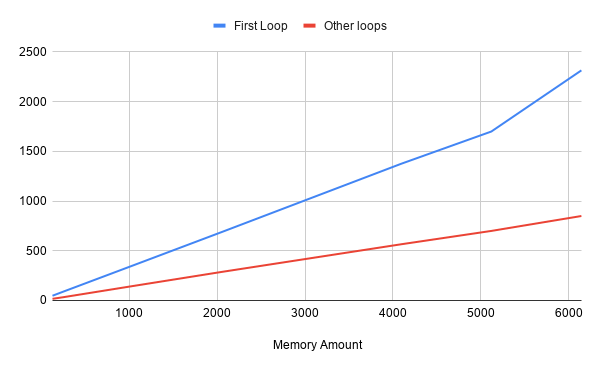

# Operating systems Three Easy Pieces: Chapter 21 solution

## Question 1

`user timing` increase when the process is running. More instances increase `user timing` linearly. But not in a slower single core machine. `user timing` reaches 100 just with one instance. Makes sense.

Number of context switch and interrupts also increase dramatically. Which is a bit odd. TLB misses shouldn't cause interrupts or context switch. And `user timing` and `system timing` was almost zero before running the program. So the increase shouldn't be that much if it is to let other programs run.

## Question 2

Amount of free doesn't increase exactly as expected. It was expected that free amount will go back to as it was. There was few hundred kilo bytes of lack in the increase when ran with `./mem 512` in a system with 1GB RAM.

Swap doesn't change, as the used memory fits in the RAM.

## Question 3

During the first loop a huge amount is swapped out and a little amount is swapped in. And then the swap out value decrease and eventually becomes zero and stays zero. This decrease is not linear. Sometimes it drops and increases again. But eventually settles down to 0

The swap in hover doesn't settle down. It keeps happening every now and then.

So the system first swaps out a huge amount to make room for the huge allocation. Then keeps swapping out more to keep a minimum number of free space (HW). When that target is met. It no longer swaps anything out. On the other hand the system always has to swap some small amounts back every now and then for other process.

After stopping swapping out, swapping small amounts in doesn't touch the LW. So the system doesn't try to swap anything else out.

## Question 4

`us` is a bit lower at first compared to when swapping doesn't happen. But `sy` is a little higher. Then some `wa` is observed. The system must have done some processing before the swapping, deciding which pages to swap out. When it is done, some waiting happens while the pages are being written to the disk.

## Question 5

## Question 6

Trying to allocating more that what is available on memory and and on swap seems to get the process killed.

## Question 7
The first loops takes 10 times more time to complete when a 2GB swap is used from an HDD compared to from an SSD.
